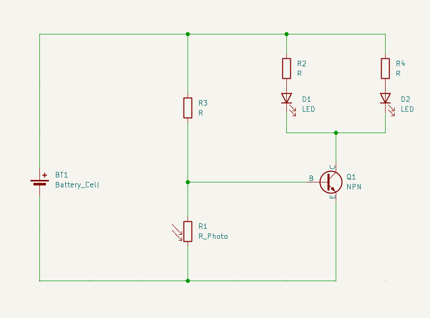
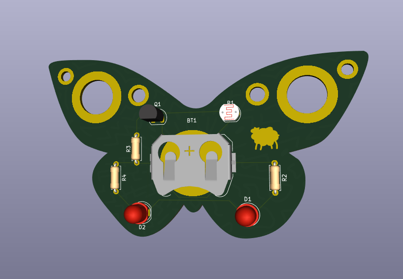

# Butterfly Charm

This is a very simple butterfly charm which is basically a light up trinket that you can hopefully attach to your bag.
It (hopefully) should only light up when you press the button to conserve power.

Slack username: Xinyang Wang

## BOM

| Item                | Qnt |
| ------------------- | --- |
| LEDs                | 4   |
| Battery holder 3034 | 1   |
| 6mm push button     | 1   |
| 200ohm resistors    | 4   |
| PCB                 | 1   |

## Images

## Thoughts

This was my first time designing a board using Kicad so it's a bit rough around the edges.
Getting the bezier curves to work was especially annoying.
There's probably a way to make an SVG the Edges.Cuts but I'm too lazy to find out how.
The electronics are really simple. It's a beginner project basically just connecting togther a batter, an LED, a resistor and a button.
Not much to explain. In fact, the most challenging part was designing the butterfly shape in Krita and getting the pattern on the back to work.
Oh hopefully the comically large vias won't destroy the structural stability of the part because I actually plan on using this.
If I have any advice for other people, it's to not use Kicad with a tiling window manager. It made things really difficult.
